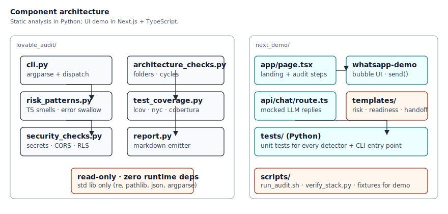
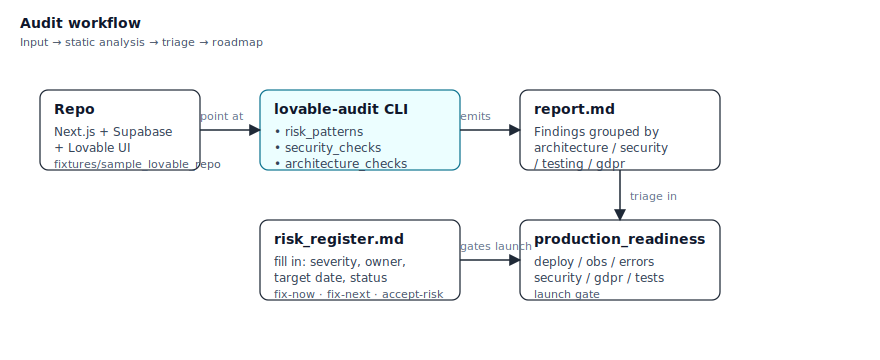
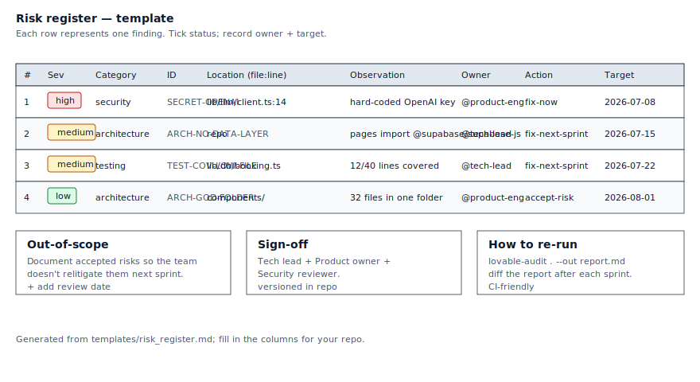

# Lovable-MVP Audit Scaffold

> **What this is:** a generic static-analysis + audit toolkit for
> Next.js / React / Supabase / Lovable-style MVPs, plus a Next.js demo
> page showcasing a WhatsApp-style AI conversation component (with a
> **mocked** LLM provider — no API keys, no network calls).
>
> **What this is NOT:** a finished vertical product for aesthetic /
> wellness clinics. That engagement is out of scope until the client
> hires us (see [OUT_OF_SCOPE.md](OUT_OF_SCOPE.md)).
>
> This repo is the **proof-of-concept** attached to the proposal at
> [PROPOSAL §3](https://github.com/9KMan/JOB-20260704130000-000131)
> — it demonstrates how we'd approach the audit + selective-feature-build
> portion of a Vertical SaaS engagement, without claiming domain expertise
> in aesthetic / wellness clinic workflows.



## Business problem solved

Lovable-built MVPs typically ship to "60% complete" with:

- a working frontend and a Supabase backend,
- a few core flows wired (auth + CRUD + maybe payments),
- a long tail of "almost-but-not-quite" features that need a senior
  engineer to triage before pilot launch.

The risk: launching without that triage loses paying pilot customers
on the first bad data-leak, broken integration, or GDPR complaint.
The opportunity: a senior engineering advisor who can ship the
priority fixes in 6–8 weeks instead of a 6-month rebuild.

This scaffold is what we'd reach for on day 1 of that engagement:

1. **Static-analysis pass** over the existing repo — surfaces
   architecture smells, security red flags, GDPR posture gaps.
2. **Risk register template** for the team to triage findings.
3. **Production-readiness checklist** for the pilot launch.
4. **Demo of the WhatsApp-style AI conversation pattern** so the
   client can see what "good" looks like for their AI assistant
   feature (mocked provider — no API key required to evaluate).

## Acceptance criteria

| ID  | Requirement |
|-----|-------------|
| REQ-001 | `lovable-audit <repo>` runs without error on a sample fixture and emits a Markdown report |
| REQ-002 | The Markdown report groups findings by severity (high / medium / low) |
| REQ-003 | Risk patterns include: console.log left in, TODO without owner, hardcoded secret, missing test file, missing error handler |
| REQ-004 | Security checks include: hardcoded secret, committed .env, dangerouslySetInnerHTML without justification, missing auth on API routes |
| REQ-005 | Architecture checks include: missing folder layout, cyclic deps in `app/`, missing `tsconfig.json`, no package-lock |
| REQ-006 | Test coverage parses both `coverage/lcov.info` (Jest) and `coverage.xml` (pytest-cov) when present |
| REQ-007 | Risk register template lists 6+ common MVP risks with severity / blast-radius / mitigation / owner columns |
| REQ-008 | Production readiness checklist covers deployment, observability, error handling, GDPR, and rollback |
| REQ-009 | Next.js demo runs without any API key (mocked LLM provider) |
| REQ-010 | The demo conversation page renders a 3-turn exchange within 1s of page load |

## What's in this repo

```
.
├── lovable_audit/        # The audit CLI (Python)
│   ├── cli.py            # `lovable-audit <repo-path> --out report.md`
│   ├── risk_patterns.py  # Code-smell detectors
│   ├── security_checks.py # Security + GDPR posture
│   ├── architecture_checks.py
│   ├── test_coverage.py  # Jest + pytest coverage parsers
│   └── report.py         # Markdown emitter
├── templates/            # Fill-in templates for the client team
│   ├── risk_register.md
│   ├── production_readiness_checklist.md
│   └── handoff_doc_template.md
├── next_demo/            # Next.js 14 + TypeScript demo
│   ├── app/
│   │   ├── page.tsx       # Landing page
│   │   ├── whatsapp-demo/page.tsx  # Mocked AI conversation
│   │   └── api/chat/route.ts        # Mock provider endpoint
│   └── package.json
├── fixtures/
│   └── sample_lovable_repo/  # Synthetic Lovable-style project (intentionally has smells)
├── tests/                # pytest suite
├── diagrams/             # SVG (architecture / audit-workflow / risk-register-template)
├── scripts/              # run_audit.sh + verify_stack.py
├── pyproject.toml
├── requirements.txt
├── Dockerfile
├── .env.example
├── OUT_OF_SCOPE.md
└── README.md             # You are here
```


## Quick start

```bash
# 1. Install the audit CLI
git clone https://github.com/9KMan/JOB-20260704130000-000131.git
cd JOB-20260704130000-000131
python3 -m venv .venv && source .venv/bin/activate
pip install -r requirements.txt

# 2. Run the audit on the bundled fixture
./scripts/run_audit.sh ./fixtures/sample_lovable_repo ./audit-report.md
# or directly:
python3 -m lovable_audit.cli ./fixtures/sample_lovable_repo --out audit-report.md

# 3. Run the test suite
pytest tests/ -v

# 4. Run the Next.js demo (requires Node 18+)
cd next_demo
npm install
npm run dev
# open http://localhost:3000/whatsapp-demo
```

## Architecture

The audit CLI is a Python package with five detection modules and a
Markdown emitter. Each detector is independent and can be invoked
standalone. The output is a Markdown report grouped by severity:

```
audit-report.md
├── Summary (file count, finding count per severity)
├── High-severity findings
├── Medium-severity findings
├── Low-severity findings
└── Per-file breakdown
```

The Next.js demo shows the WhatsApp-style conversation pattern with a
mocked LLM provider — no real OpenAI / Anthropic key required. The
client can swap in their real provider by replacing the `/api/chat`
handler.





## Tech stack

| Layer | Choice | Why |
|-------|--------|-----|
| Audit CLI | Python 3.11+ | Standard, mature ecosystem |
| Static analysis | regex + path checks | Fast, no compile step, reproducible |
| Coverage parsing | coverage/lcov.info + coverage.xml | Both Jest + pytest-cov formats |
| Report format | Markdown | Copy-paste into PR / Notion / deliverable |
| Demo frontend | Next.js 14 + TypeScript + Tailwind | Matches Lovable's stack |
| Mocked LLM | Local deterministic stub | No API key required to evaluate |

## Why these choices

- **Regex + path checks over AST/AST-based tools:** for an audit scaffold
  that runs on a repo you don't control, regex is robust against
  unparseable code, version skew, and missing type info. AST-based tools
  add power but require more setup; for the "first pass" triage this is
  faster and more accessible.
- **Markdown report over HTML / PDF:** deliverable goes into the client's
  PR description or Notion. Markdown copy-pastes cleanly. HTML/PDF add
  formatting complexity for marginal gain at this stage.
- **Mocked LLM over real provider:** the demo proves the conversation
  pattern works. The client can replace the mock with their real provider
  in 30 minutes of work; that's a fast path from "see what good looks
  like" to "ship it for real".
- **Generic scaffold over clinic-specific code:** domain expertise in
  aesthetic / wellness clinic workflows is out of scope for this PoC.
  When the engagement starts, we'd discover the actual codebase and
  customise the audit rules — this scaffold is the starting point.

## What's NOT in this repo

See [OUT_OF_SCOPE.md](OUT_OF_SCOPE.md) for the deferred-features list.
Highlights:

- **Real vertical-SaaS product code** for aesthetic / wellness clinics
  (we'd build that AFTER the kickoff, with code review of the actual
  Lovable-built MVP)
- **Real LLM integration** in the demo (mocked stub for evaluation only)
- **Production deployment** (Vercel, Railway, Fly — would set up after kickoff)
- **GDPR-specific compliance audit** (the scaffold lists GDPR items;
  a real compliance audit needs DPO + legal review)

## Documentation

- [OUT_OF_SCOPE.md](OUT_OF_SCOPE.md) — explicit deferred-features list
- [templates/risk_register.md](templates/risk_register.md) — fill-in template
- [templates/production_readiness_checklist.md](templates/production_readiness_checklist.md)
- [templates/handoff_doc_template.md](templates/handoff_doc_template.md)
- [diagrams/architecture.svg](diagrams/architecture.svg)
- [diagrams/audit-workflow.svg](diagrams/audit-workflow.svg)
- [diagrams/risk-register-template.svg](diagrams/risk-register-template.svg)

## License

Proprietary — internal use only.

## Built by

Software Factory — JOB-20260704130000-000131 (PoC scaffold for Vertical
SaaS audit engagement, attached to the proposal that declines the
founder-track framing in favour of an hourly-contractor-track review).